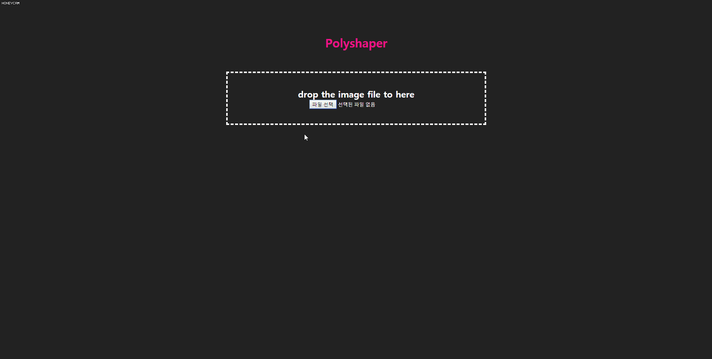
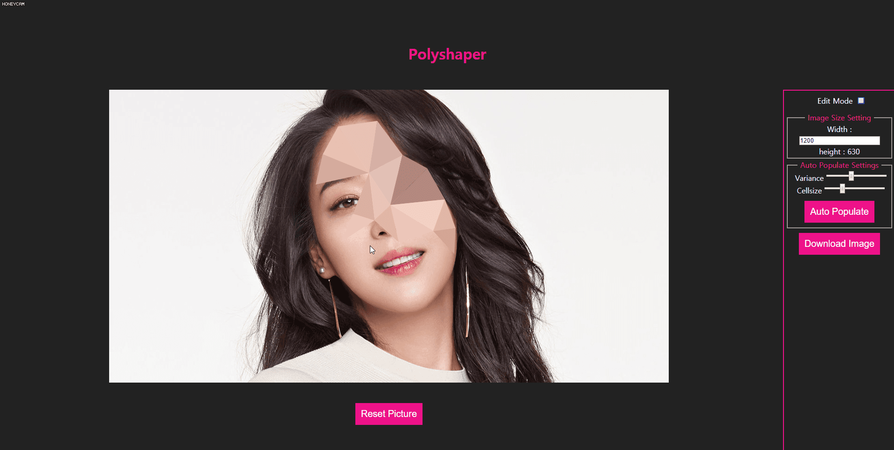
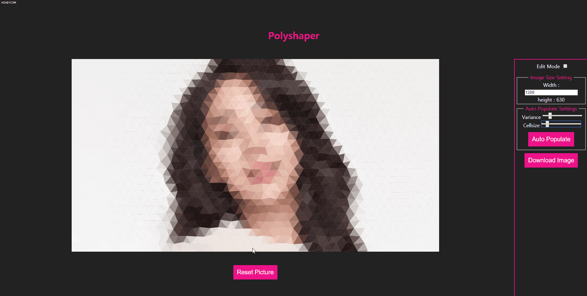
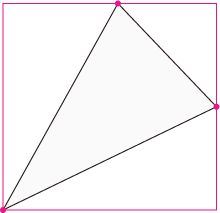
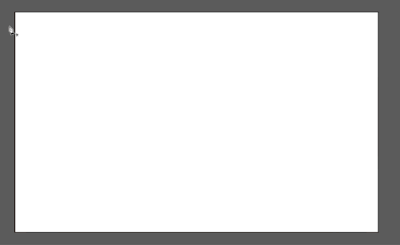
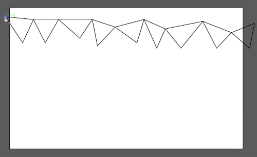

# [Polyshaper](https://polyshaper.me/)



## Introduction
Polyshaper는 업로드한 이미지를 기반으로 색상을 자동으로 채워주어 일러스트레이터나 포토샵보다 편하고 빠르게 로우 폴리 이미지를 제작할 수 있는 로우 폴리 이미지 제작 어플리케이션입니다.

## Period
2018년 10월 20일 ~ 11월 2일

## Prerequisites
- Chrome Browser(권장)

## Installation
```
git clone https://github.com/kimkyeseung/polyshaper.git
npm install
npm start
```

## Feature
- 메인페이지에서 이미지를 업로드할 수 있습니다.
- 이미지 파일을 드래그 앤 드랍으로 업로드 할 수 있습니다.
- 업로드한 파일이 10MB 이내의 이미지 파일인지 검사하여 아닐시 경고창을 표시합니다.
- 이미지 업로드 후 마우스 클릭으로 점을 찍을 수 있습니다.
- 점이 세 개가 찍히면 자동으로 삼각형이 형성되고 해당 영역의 이미지 색상 평균 값으로 채워집니다.
- 만들어진 삼각 폴리에는 각 꼭지 점마다 스냅이 생겨 일정 거리 이내의 영역을 클릭하게 되면 점에 물리도록 되어있습니다.
- EditMode로 변경시 (단축키 : ```Ctrl(command) + E```) 만들어진 면의 영역을 수정할 수 있습니다. (기본 : AddMode)
- EditMode에서는  ```Ctrl(command) + E``` + 마우스 클릭으로 해당 셀을 직접 선택하여 색상을 원하는 색상으로 변경할 수 있습니다.



- ```Variance```와 ```Cellsize```를 조정하고 ```Auto Populate``` 기능으로 남은 배경을 자동으로 완성시킬 수 있습니다.
- ```Variance``` : 각 폴리 들의 랜덤한 정도를 조정합니다. 0 부터 1까지 입력 가능하며 0이면 모든 셀이 가지런한 정삼각형이, 1이면 불규칙적이고 자유도가 높은 모양이 됩니다. (기본 0.4)
- ```Cellsize``` : 각 폴리의 크기를 결정합니다. 셀의 크기가 작아질 수록 이미지의 선명도가 높아지지만 폴리아트의 느낌이 줄어들고 속도가 느려지게 됩니다. 기본 크기는 60px이며 최소 10px에서 최대 200px로 설정해두었습니다.
- AddMode에서 점을 찍고 삼각형을 완성시키지 않은채 에딧모드로 변경하면 점은 취소되어 사라집니다.
- AddMode에서 점을 찍고 삼각형을 완성시키지 않은채 ```Esc```를 누르면 점은 취소되어 사라집니다.
- ```Auto Populate``` 시에 생기는 폴리 이미지는 유저가 만든 폴리와는 별개로 컨트롤 되며 유저가 만든 폴리 아래에 있는 레이어로 취급됩니다.
- ```Download Image``` 버튼을 통하여 제작한 폴리 이미지를 저장할 수 있습니다.
- ```Reset Picture``` 버튼을 통하여 업로드한 이미지를 없애고 새로 이미지를 업로드할 수 있습니다.



## Tech Stack
- 자바스크립트(ES2015+)를 기본으로 제작하였습니다.
- Redux 라이브러리를 사용한 Flux 아키텍처 기반 설계를 하였습니다.
- React, Webpack, CSS Modules을 사용한 컴포넌트 베이스 UI 아키텍처를 구현하였습니다.
- HTML5 Canvas를 이용하여 그래픽 아트웍을 구현하였습니다.

## Continuous Integration
- 소스관리/빌드/테스트/배포의 지속적인 통합을 위한 CircleCI를 사용하였습니다.

## Deployment
netlify를 이용하여 github repository를 배포하였습니다.

## Version Control
- Client, Server의 GIT Repoitory를 구분하여 독립적인 관리를 하였습니다.

## Planning
- Trello를 이용하여 일정을 관리하여 진행하였습니다. 

## Test
Jest와 Enzyme를 이용하여 Reducer및 Component 단위 테스트 구현

## challenge
### 사각형이 아닌 영역의 색상값 추출하기
Polyshaper의 처음 기획 당시 가장 큰 관건이었습니다. 유저가 클릭하여 만들어낸 임의의 삼각형의 색상값만 추출이 되지 않는다면 이 프로젝트의 시작조차할 수 없었을 것입니다. Stack Overflow와 여러 기술 블로그, 개발 커뮤니티를 찾아다녔지만 저와 같은 목적으로 저와 같은 고민을 하는 사람은 없었습니다. 다행히 생각보다 쉽게 해결되었습니다.

```js
getColorAverage(x1, y1, x2, y2, x3, y3) {
    const colorContext = this.colorCanvas.current.getContext('2d');
    colorContext.save();
    colorContext.beginPath();
    colorContext.moveTo(x1, y1);
    colorContext.lineTo(x2, y2);
    colorContext.lineTo(x3, y3);
    colorContext.closePath();
    colorContext.clip();
    let image = document.createElement('img');
    image.src = this.props.uploadedImage;
    colorContext.drawImage(image, 0, 0);
    let biggestX = Math.max(x1, x2, x3);
    let biggestY = Math.max(y1, y2, y3);
    let smallestX = Math.min(x1, x2, x3);
    let smallestY = Math.min(y1, y2, y3);
    let colorData = colorContext.getImageData(smallestX, smallestY, Math.ceil(biggestX - smallestX) || 1, Math.ceil(biggestY - smallestY) || 1);
    let count = 0;
    const rgb = { r: 0, g: 0, b: 0 };
    for (let i = -4; i < colorData.data.length; i += 20) {
      if (colorData.data[i + 3] > 200) {
        ++count;
        rgb.r += colorData.data[i];
        rgb.g += colorData.data[i + 1];
        rgb.b += colorData.data[i + 2];
      }
    }
    rgb.r = ~~(rgb.r / count);
    rgb.g = ~~(rgb.g / count);
    rgb.b = ~~(rgb.b / count);
    colorContext.restore();
    return rgb;
  }
```

색상을 추출하기 위해선 빈 캔버스에 해당 이미지를 새로 그려야했습니다. 폴리가 그려질 캔버스와 같은 위치에 같은 크기의 캔버스를 포개고 세개의 점을 좌표로 받아서 삼각형을 만든 후 ```clip()```으로 이미지를 삼각형만큼 오렸습니다. 처음엔 ```createElement(‘img’)```  -> ```drawImage()``` -> ```beginPath()``` -> ```closePath()``` -> ```clip()``` -> ```getImageData()``` 순으로 코드를 작성하였는데 생각대로 진행되지 않았고 ```clip()``` 이 ```drawImage()```보다 선행되어야만 제가 원하는 결과를 얻을 수 있었습니다. 



```ctx.getImageData(sx, sy, sw, sh)``` 매소드는 이미지 데이터를 얻을 사각형 영역의 네 좌표만 받기 때문에 어쩔 수 없이 삼각형이 포함된 영역 전체의 좌표를 구하여야 하였습니다. ```ctx.getImageData()```의 리턴 값(의 ```.data```)은 단순히 픽셀 하나당 rgba의 순서로 이루어진 배열이었습니다. alpha 값이 제공되지 않았더라면 조금더 복잡한 연산이었을텐데 alpha값이 제공되고 사각형 중 삼각형의 영역이 아닌 부분의 alpha가 0이어서 쉽게 필터링할 수 있었습니다. 데이터를 자세히 살펴보니 안티앨리어싱이 적용된 것인지 alpha값이 0, 255 이렇게 두 값이 아닌 많은 중간값이 적용되어있었습니다. 저는 어느정도 확실한 이미지만을 얻는게 좋겠다고 생각이 들어서 200 이상의 값만 걸러 색상값으로 구하였습니다. 그리고 ```~~```연산자에 대해 알게되었는데 ```Math.floor()```와 같은 결과를 얻을 수 있지만 더 빠르게 결과를 얻을 수 있다고 합니다.

### 자동으로 완성시키기 (Auto Polpulate)
아트웍이라는 것은 무슨 툴을 사용하더라도 노력과 시간이 필요할 수 밖에 없습니다. 색상의 값을 자동으로 구해준다 하더라도 각 폴리의 모든 꼭지점은 사용자가 클릭한 좌표를 토대로 존재하기 때문에 모든 점을 사용자가 클릭해야 한다는 점이 오래걸리고 귀찮게 여겨지는게 당연하다고 생각하였습니다. 그래서 저는 유저가 몇개의 폴리를 만들고 나면 그 폴리를 토대로 자동으로 완성되는 기능이 있기를 바랐습니다. 결론적으로 유저가 만든 폴리의 좌표를 토대로 남은 부분을 자동으로 채울 수는 없었지만 자동 완성된 배경을 하위 레이어로 추가하는 방법을 선택하였습니다.

```js
const autoPopulate = data => {
  const result = cloneDeep(data);
  const backgroundVertexNode = [];
  let row = 0;
  let col = 0;
  let maxCols = result.backgroundMaxCols;
  let maxRows = result.backgroundMaxRows;
  if (!maxCols && !maxRows) {
    return result;
  }
  let amount = maxCols * maxRows;
  for (let i = 0; i < amount; i++) {
    let vertex = {};
    if (row % 2 === 0) {
      vertex.x = (col * result.backgroundCellSize) - result.backgroundCellSize;
    } else {
      vertex.x = (col * result.backgroundCellSize) - result.backgroundCellSize - result.backgroundCellSize / 2;
    }
    vertex.x = vertex.x + (Math.random() - 0.5) * result.backgroundVariance * result.backgroundCellSize * 2;
    vertex.y = (row * result.backgroundCellSize * 0.865) - result.backgroundCellSize;
    vertex.y = vertex.y + (Math.random() - 0.5) * result.backgroundVariance * result.backgroundCellSize * 2;
    vertex.col = col;
    vertex.row = row;
    backgroundVertexNode.push(vertex);
    col++;
    if ((i + 1) % maxCols === 0) {
      row++;
      col = 0;
    }
  }
  result.backgroundVertexNode = backgroundVertexNode;
  return result;
}
```

인자로 받는 ```data```는 ```backgroundCellSize```, ```backgroundVariance```가 입력되어 있는 state 객체입니다. CellSize는 완성될 폴리 셀의 크기, Variance는 셀의 모양의 다양성입니다. 이 함수는 [Low Poly Background](https://cojdev.github.io/lowpoly/)의 코드를 많이 참고하였습니다. Low Poly Background는 색상의 대비 정도를 결정하는 Depth도 받지만 저는 색상값은 업로드한 이미지를 기준으로 하기 때문에 Depth를 빼고 적절하게 필요한 부분만 잘 추출하였습니다. 사용자가 업로드한 이미지를 기준으로 한 width와 height와 설정한 (혹은 기본값의) CellSize와 Variance를 토대로 가로에 들어갈 Poly의 갯수와 세로에 들어갈 Poly의 갯수를 정하고 각각의 좌표를 배열로 보관합니다.

```js
drawBackground(vertices) {
    console.log('draw bg');
    const context = this.backgroundLayer.current.getContext('2d');
    let maxCols = this.props.backgroundMaxCols;
    let colorData;
    for (let i = 0; i < vertices.length; i++) {
      if (vertices[i].row % 2 === 0 && vertices[i + maxCols + 1] && vertices[i].col < maxCols - 1) {
        context.beginPath();
        context.moveTo(vertices[i].x, vertices[i].y);
        context.lineTo(vertices[i + maxCols].x, vertices[i + maxCols].y);
        context.lineTo(vertices[i + maxCols + 1].x, vertices[i + maxCols + 1].y);
        context.closePath();
        colorData = this.getColorAverage(vertices[i].x, vertices[i].y, vertices[i + maxCols].x, vertices[i + maxCols].y, vertices[i + maxCols + 1].x, vertices[i + maxCols + 1].y);
        context.fillStyle = `rgb(${colorData.r}, ${colorData.g}, ${colorData.b})`;
        context.fill();

        context.beginPath();
        context.moveTo(vertices[i].x, vertices[i].y);
        context.lineTo(vertices[i + 1].x, vertices[i + 1].y);
        context.lineTo(vertices[i + maxCols + 1].x, vertices[i + maxCols + 1].y);
        context.closePath();
        colorData = this.getColorAverage(vertices[i].x, vertices[i].y, vertices[i + 1].x, vertices[i + 1].y, vertices[i + maxCols + 1].x, vertices[i + maxCols + 1].y);
        context.fillStyle = `rgb(${colorData.r}, ${colorData.g}, ${colorData.b})`;
        context.fill();

      } else if (vertices[i - 1] && vertices[i + maxCols] && vertices[i].col > 0) {
        context.beginPath();
        context.moveTo(vertices[i].x, vertices[i].y);
        context.lineTo(vertices[i - 1].x, vertices[i - 1].y);
        context.lineTo(vertices[i + maxCols - 1].x, vertices[i + maxCols - 1].y);
        context.closePath();
        colorData = this.getColorAverage(vertices[i].x, vertices[i].y, vertices[i - 1].x, vertices[i - 1].y, vertices[i + maxCols - 1].x, vertices[i + maxCols - 1].y);
        context.fillStyle = `rgb(${colorData.r}, ${colorData.g}, ${colorData.b})`;
        context.fill();

        context.beginPath();
        context.moveTo(vertices[i].x, vertices[i].y);
        context.lineTo(vertices[i + maxCols].x, vertices[i + maxCols].y);
        context.lineTo(vertices[i + maxCols - 1].x, vertices[i + maxCols - 1].y);
        context.closePath();
        colorData = this.getColorAverage(vertices[i].x, vertices[i].y, vertices[i + maxCols].x, vertices[i + maxCols].y, vertices[i + maxCols - 1].x, vertices[i + maxCols - 1].y);
        context.fillStyle = `rgb(${colorData.r}, ${colorData.g}, ${colorData.b})`;
        context.fill();
      }
    }
  }
```

```autoPopulate```로 만들어진 backgroundVertexNode 배열을 토대로 폴리 이미지를 그려내는 함수입니다. 그리는 방식은 삼각형 한 번, 역삼각형 한 번 교차로 그려냅니다. 처음 그렸던 삼각형의 오른쪽 두 점은 그 다음 그려질 역삼각형의 왼쪽 두 점이 됩니다. 그 역삼각형의 오른쪽 두 점은 다시 오른쪽에 위치할 삼각형의 왼쪽 두 점이 됩니다. col이 maxCol이 되면 col은 0이되고 low는 + 1 되어 두 번째 줄부터는 역삼각형, 삼각형의 순서로 다시 삼각형이 그려지게 됩니다. 그렇게 화면을 가득 채울때까지 반복하게 됩니다.




일러스트레이터로 구현한 폴리 이미지 드로잉 메커니즘
~~Guide를 끄고 캡쳐하였으면 좋았을 것을~~

### 캔버스에 그려진 폴리를 선택하기
캔버스에 그려진 이미지는 말 그대로 이미지이기 때문에 DOM의 엘리먼트처럼 따로 이벤트를 추가하거나 선택할 수 있는 개념이 아니었습니다. 그럼에도 불구하고 저는 각각의 폴리를 선택할 수 있어야 한다고 생각했습니다. 디지털 작업이니만큼 한 번 추가한 것으로 끝이 아니라 편집 및 수정이 가능해야만 툴로써의 가치가 있다고 생각하였기 때문입니다. 각 폴리 셀들은 x, y의 세 좌표로 이루어져 하나의 면을 구성하고 있습니다. 마우스를 폴리 위에 올렸을 때 마우스의 좌표(x, y)가 해당 폴리 위에 있는지 아닌지 확인하는 함수를 만들어야 했습니다.

```js
selectPoly(x, y) {
    const vector = (from, to) => [to[0] - from[0], to[1] - from[1]];
    const dot = (u, v) => u[0] * v[0] + u[1] * v[1];
    const faceNode = this.props.faceNode.slice();
    const vertexNode = this.props.vertexNode.slice();
    for (let i = 0; i < faceNode.length; i++) {
      let p = [x, y];
      let a = [vertexNode[faceNode[i].vertices[0]].x, vertexNode[faceNode[i].vertices[0]].y];
      let b = [vertexNode[faceNode[i].vertices[1]].x, vertexNode[faceNode[i].vertices[1]].y];
      let c = [vertexNode[faceNode[i].vertices[2]].x, vertexNode[faceNode[i].vertices[2]].y];
      let v0 = vector(a, c);
      let v1 = vector(a, b);
      let v2 = vector(a, p);
      let dot00 = dot(v0, v0);
      let dot01 = dot(v0, v1);
      let dot02 = dot(v0, v2);
      let dot11 = dot(v1, v1);
      let dot12 = dot(v1, v2);
      let invDenom = 1.0 / (dot00 * dot11 - dot01 * dot01);
      let u = (dot11 * dot02 - dot01 * dot12) * invDenom;
      let v = (dot00 * dot12 - dot01 * dot02) * invDenom;
      if ((u >= 0) && (v >= 0) && (u + v < 1)) {
        this.props.faceSelectHandler(faceNode[i]);
        this.props.noticeMessage(`Select Indivisual Poly No. ${i}`);
        i = faceNode.length;
      }
    }
  }
```

```selectPoly()``` 함수는 [이 곳](http://blackpawn.com/texts/pointinpoly/default.html)을 참고하여 점이 삼각형 위에 위치하면 true를, 그렇지 않으면 false를 리턴하는 함수를 변형시켜 적용하였습니다. 


## Things to do
2주 동안의 완성을 목표로 좀 더 완성도를 높은 어플리케이션을 구현하고 싶어 Server는 애초에 기획에서 제외하였습니다. 
가능한 정교하고 디테일하게 기능 구현을 하려고 하였으며 기능 구현 가능 여부가 불확실했던 상황이있었지만 잘 마무리 되어서 기쁘게 생각합니다.
처음 기획했던 기능을 구현하고 나서는 계속해서 단축키를 비롯한 디테일한 UI의 개선이 욕심이 있습니다.

- 배경 및 사용자 추가 폴리 레이어 시각화 및 개별 컨트롤 가능하게 하기 (포토샵처럼)
- 각 폴리 셀 별 테두리 두께 및 색상 입력 가능하게 하기 
- firebase 등을 이용하여 완성된 이미지 DB나 스토리지에 보관하여 갤러리 게시판 만들어 업로드하기
- 실행취소(Undo) 및 실행취소취소(Redo) 기능추가 하기
- 전반적인 UI 개선으로 좋은 사용자 경험 제시하기
- Code Refactoring
- Integration Test
